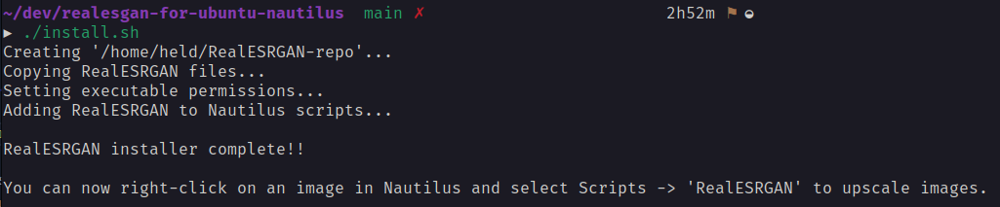
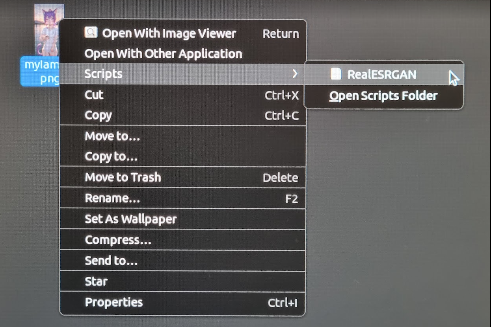
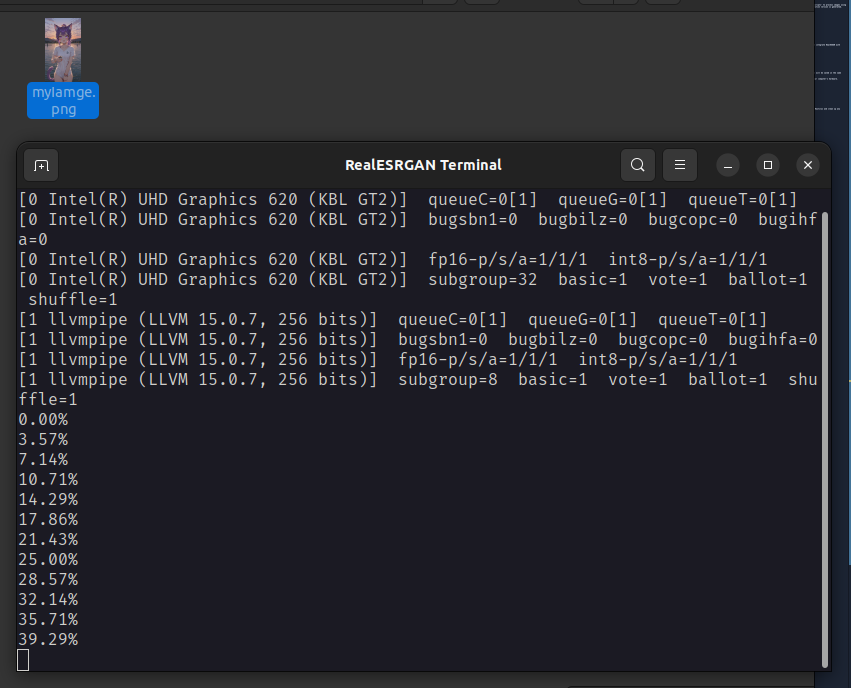
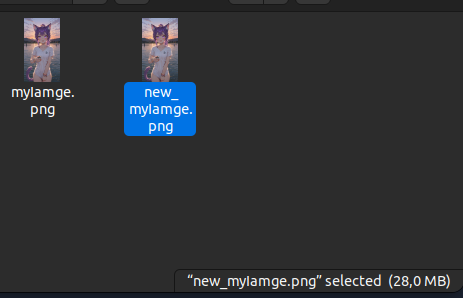
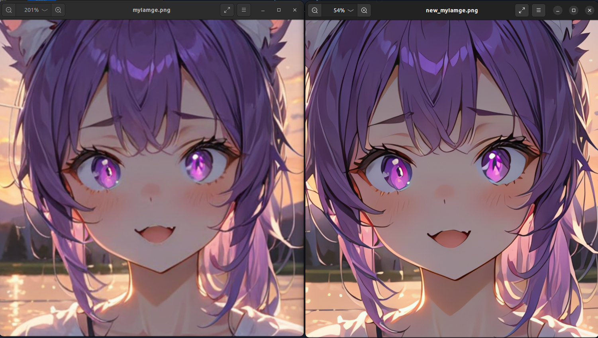

# realesgan-for-ubuntu-nautilus

RealESGAN for Ubuntu - Nautilus

## About the project

This project implements the portable version of [RealESGAN](https://github.com/xinntao/Real-ESRGAN) for Linux (Ubuntu), integrated with the Nautilus file manager.It allows improving the quality of low-resolution images directly through the Nautilus context menu.

## How it works

The project adds an option in the Nautilus context menu inside 'scripts' to process images using RealESGAN. When selected, the image is processed and a high-resolution version is generated.

## Installation

To install the project, follow these steps:

1. Clone the repository to your local machine.
2. Navigate to the project directory.
3. Give execution permission to the installation script:

   `chmod +x install.sh`

4. Run the installation script:

   `./install.sh`

   

The installation script will set up the necessary environment and integrate RealESGAN with Nautilus.

## Usage

After installation, you can use RealESGAN as follows:

1. Open Nautilus (Ubuntu file manager).
2. Right-click on an image.
3. In the context menu, select the option `Scrips`, then select `RealESGAN` to process the image

   

4. Wait for the processing to complete. The high-resolution image will be saved in the same directory.

   
   

5. Enjoy the improved image quality!

   

Note: Processing time may vary depending on the image size and your computer's hardware.

## Uninstallation

To uninstall the project, follow these steps:

1. Navigate to the project directory.
2. Give execution permission to the uninstallation script:

   `chmod +x uninstall.sh`

3. Run the uninstallation script:

   `./uninstall.sh`

The uninstallation script will remove RealESGAN integration from Nautilus and clean up any installed components.
